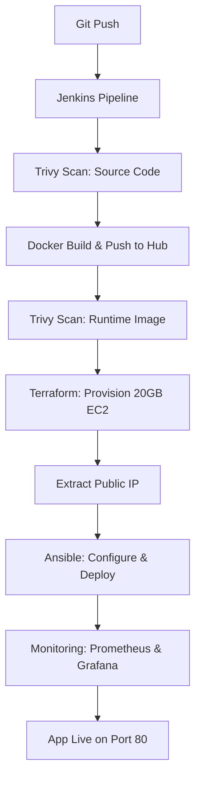

## The Architectural Flow




---


## Phase 1: Environment Setup


### 1. External Prerequisites

* **AWS IAM:** Create a user with `AdministratorAccess`. Generate **Access Key** and **Secret Key**.

* **AWS EC2:** Create an RSA Key Pair named `devops-key.pem`.

* **DockerHub:** An active account to host your images.


### 2. Jenkins-in-Docker Initialization

You ran Jenkins as a container but linked it to the host’s Docker engine to enable "Docker-out-of-Docker" capabilities.

```bash

docker run -d -p 8080:8080 -p 50000:50000 \

  -v jenkins_home:/var/jenkins_home \

  -v /var/run/docker.sock:/var/run/docker.sock \

  --name jenkins jenkins/jenkins:lts

```


### 3. Toolchain Installation (Inside Jenkins Container)

You manually entered the container as `root` to install the engine for the pipeline.

```bash

docker exec -u root -it jenkins bash


# 1. Base dependencies

apt update && apt install -y python3 python3-pip ansible wget unzip gnupg lsb-release


# 2. Terraform (v1.15.1)

wget https://releases.hashicorp.com/terraform/1.15.1/terraform_1.15.1_linux_amd64.zip

unzip terraform_1.15.1_linux_amd64.zip && mv terraform /usr/local/bin/


# 3. Trivy (Security Scanner)

wget -qO - https://aquasecurity.github.io/trivy-repo/deb/public.key | gpg --dearmor -o /etc/apt/keyrings/trivy.gpg

echo "deb [signed-by=/etc/apt/keyrings/trivy.gpg] https://aquasecurity.github.io/trivy-repo/deb $(lsb_release -sc) main" | tee /etc/apt/sources.list.d/trivy.list

apt update && apt install -y trivy


# 4. Fix Docker Permissions

chmod 666 /var/run/docker.sock

exit

```


---


## Phase 2: Jenkins Credential Mapping

You added the following IDs to Jenkins **(Manage Jenkins > Credentials)**:

| ID | Type | Content/Use |

| :--- | :--- | :--- |

| `aws-access-key` | Secret Text | AWS Access Key |

| `aws-secret-key` | Secret Text | AWS Secret Key |

| `dockerhub-id` | Username/Password | DockerHub Login |

| `ec2-ssh-key` | SSH Username with Private Key | Username: `ec2-user` + Paste `.pem` content |


---


## Phase 3: Detailed Pipeline Execution


### Step 1: Security Gates (Trivy)

* **Code Scan:** Checks `package.json` for vulnerable dependencies before building.

* **Image Scan:** Checks the final Docker layers for OS vulnerabilities.


### Step 2: Infrastructure as Code (Terraform)

* **Provisioning:** Creates a Security Group with ports **22, 80, 3000 (Grafana), and 9090 (Prometheus)** open.

* **Scaling:** We specifically updated the `root_block_device` to **20GB** to handle the storage requirements of the monitoring stack.


### Step 3: Configuration Management (Ansible)

Ansible performs the heavy lifting on the fresh EC2 instance:

1.  **Hardware Sensor:** Installs **Node Exporter** as a `systemd` service to track CPU/RAM.

2.  **Monitoring Containers:** Pulls and runs **Prometheus** (configured via `prometheus.yml`) and **Grafana**.

3.  **Application Deployment:** Pulls your latest DockerHub image and maps it to **Port 80**.


---


## Phase 4: Observability Setup

Once the pipeline finishes:

1.  **Prometheus:** Access at `http://<EC2_IP>:9090`. Verify targets are "UP".

2.  **Grafana:** Access at `http://<EC2_IP>:3000`.

    * **DataSource:** Add Prometheus with URL `http://localhost:9090`.

    * **Dashboard:** Import **ID 1860**. This provides the real-time gauges for CPU and Memory you saw in your screenshots.


---


## Phase 5: Critical Maintenance Commands

* **State Conflict:** If you see `Duplicate Security Group`, go to AWS Console and manually delete `devops-sg`.

* **Disk Full:** Run `docker system prune -af` inside the EC2 if logs or old images build up.

* **Cleanup:** Run `terraform destroy -auto-approve` to stop AWS billing when the project is not in use.


---

