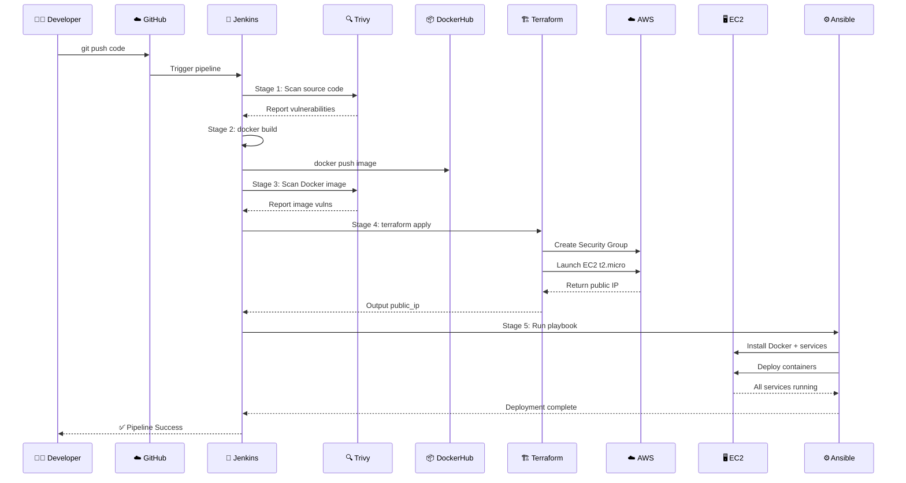

# 🚀 DevSecOps CI/CD Pipeline — Complete Flow Document

> **Version:** 1.0  
> **Project:** End-to-End DevSecOps Pipeline  
> **Last Updated:** 2026-06-27

---

## 📑 Table of Contents

1. [Introduction to DevSecOps](#1-introduction-to-devsecops)
2. [Project Architecture Overview](#2-project-architecture-overview)
3. [Full Architecture Diagram](#3-full-architecture-diagram)
4. [Component Definitions with Examples](#4-component-definitions-with-examples)
5. [Complete Pipeline Flow (Step-by-Step)](#5-complete-pipeline-flow-step-by-step)
6. [Security Scanning — Deep Dive](#6-security-scanning--deep-dive)
7. [Infrastructure as Code (IaC) — Deep Dive](#7-infrastructure-as-code-iac--deep-dive)
8. [Configuration Management — Deep Dive](#8-configuration-management--deep-dive)
9. [Observability Stack — Deep Dive](#9-observability-stack--deep-dive)
10. [CI/CD Pipeline Complete Code Flow](#10-cicd-pipeline-complete-code-flow)
11. [Advanced Concepts](#11-advanced-concepts)
12. [Troubleshooting & Maintenance](#12-troubleshooting--maintenance)

---

## 1. Introduction to DevSecOps

### 1.1 What is DevSecOps?

**DevSecOps** (Development + Security + Operations) is a culture, movement, and practice that integrates **security** into every phase of the software development lifecycle, rather than treating it as an afterthought. It's often referred to as **"Shifting Security Left"** — meaning security checks happen early and often.

### 1.2 The "Three Ways" of DevSecOps

| Way | Principle | In Our Project |
|:---|:---|:---|
| **First Way** | Flow (left-to-right) | Code → Build → Scan → Deploy → Monitor |
| **Second Way** | Feedback (right-to-left) | Security scan results block bad builds |
| **Third Way** | Continuous Learning | Monitoring data informs future optimizations |

### 1.3 Key Terminology

| Term | Definition | Example in This Project |
|:---|:---|:---|
| **CI (Continuous Integration)** | Automatically building & testing code on every commit | Jenkins builds Docker image on every Git push |
| **CD (Continuous Deployment)** | Automatically deploying tested code to production | Ansible deploys Docker container to EC2 |
| **IaC (Infrastructure as Code)** | Managing infrastructure through definition files | Terraform `.tf` files define EC2 instance |
| **Security Gate** | A checkpoint that enforces security policies | Trivy scans blocking CRITICAL/HIGH vulns |
| **Observability** | Understanding system state from external outputs | Prometheus + Grafana show CPU/RAM/Disk metrics |
| **Containerization** | Packaging app + dependencies into lightweight unit | Docker image containing Node.js app |

---

## 2. Project Architecture Overview

### 2.1 Project Structure

```
DevSecOps-Pipeline/
├── .gitignore                  # Git ignore rules
├── Jenkinsfile                 # CI/CD pipeline definition (Jenkins)
├── Dockerfile                  # Docker image build instructions
├── Readme.md                   # High-level documentation
├── runbook.md                  # Runbook with commands & flow
├── app/                        # Application source code
│   ├── index.js                # Express.js web app (Node.js)
│   └── package.json            # Node.js dependencies
├── terraform/                  # Infrastructure as Code
│   ├── main.tf                 # AWS resource definitions
│   ├── terraform.tfstate       # State file (tracks real-world resources)
│   └── .terraform.lock.hcl     # Provider version lock file
├── ansible/                    # Configuration Management
│   └── playbook.yml            # Ansible playbook for EC2 setup
├── monitoring/                 # Observability
│   └── prometheus.yml          # Prometheus scrape configuration
└── public/                     # Pipeline screenshots
```


### 2.2 Technology Stack

| Layer | Technology | Version/Purpose |
|:---|:---|:---|
| **CI/CD Engine** | Jenkins | LTS — Orchestrates the entire pipeline |
| **Version Control** | Git + GitHub | Source code management |
| **Application** | Node.js + Express | Simple web server on port 3000 |
| **Containerization** | Docker | Builds, ships, and runs the app |
| **Image Registry** | DockerHub | Stores built Docker images |
| **Security Scanner** | Trivy | Scans code & images for vulnerabilities |
| **IaC Tool** | Terraform | v1.15.1 — Provisions AWS EC2 |
| **Cloud Provider** | AWS | EC2 (t2.micro), EBS (20GB gp3) |
| **Config Management** | Ansible | Automates EC2 software setup |
| **Metrics Collector** | Prometheus | Scrapes Node Exporter every 15s |
| **Hardware Exporter** | Node Exporter | Exposes CPU/RAM/Disk metrics at :9100 |
| **Visualization** | Grafana | Dashboards (ID 1860) connected to Prometheus |

### 2.3 Network Ports & Security

| Port | Service | Purpose | Restricted? |
|:---|:---|:---|:---|
| 22 | SSH | Ansible connects to EC2 | Yes (Security Group) |
| 80 | Application (Nginx/App) | User accesses the web app | Public |
| 3000 | Grafana | Monitoring dashboards | Public |
| 9090 | Prometheus | Metrics UI | Public |
| 9100 | Node Exporter | Prometheus scrapes metrics here | Internal only |

---

## 3. Full Architecture Diagram

### 3.1 High-Level Pipeline Flow

```mermaid
graph TD
    DEV[("👨‍💻 Developer")] -->|"git push"| GH[("☁️ GitHub Repo")]
    GH -->|"Webhook / Poll SCM"| JENKINS

    subgraph JENKINS [🐧 Jenkins Container (Docker-out-of-Docker)]
        direction TB
        A[Pipeline Start]
        A --> B["🔍 Stage 1: Trivy FS Scan<br/>(Code Security Gate)"]
        B -->|"Pass/Fail"| C["🐳 Stage 2: Docker Build"]
        C --> D["📦 Docker Push → DockerHub"]
        D --> E["🔍 Stage 3: Trivy Image Scan<br/>(Runtime Security Gate)"]
        E --> F["🏗️ Stage 4: Terraform Init & Apply"]
        F --> G["🌐 Extract EC2 Public IP"]
        G --> H["⚙️ Stage 5: Ansible Deploy"]
    end

    D --> DOCKERHUB[("☁️ DockerHub Registry")]
    DOCKERHUB -.->|"pull image"| EC2
    F -.->|"Provision"| AWS[("☁️ AWS Cloud")]
    AWS -->|"Creates"| EC2

    subgraph EC2 [🖥️ AWS EC2 Instance]
        direction TB
        NE["📊 Node Exporter<br/>(Port 9100)"]
        PROM["📈 Prometheus<br/>(Port 9090)"]
        GRAF["📉 Grafana<br/>(Port 3000)"]
        APP["🌐 App Container<br/>(Port 80 → 3000)"]
        NE -.->|"scrape :9100"| PROM
        PROM -.->|"data source"| GRAF
    end

    H -->|"SSH + Ansible"| EC2
    GRAF -->|"View Dashboards"| USER[("👤 End User")]
    APP -->|"Visit Website"| USER
```

### 3.2 Data Flow Diagram



---

## 4. Component Definitions with Examples

### 4.1 Jenkins Pipeline (`Jenkinsfile`)

**Definition:** A declarative Jenkins pipeline defining the entire CI/CD process as code.

**Jenkins** is an open-source automation server that automates building, testing, and deploying software. It's the **orchestrator** of this entire pipeline.

**Key Concepts:**
| Concept | Definition | Example |
|:---|:---|:---|
| **Pipeline** | Entire CI/CD process defined in `Jenkinsfile` | `pipeline { ... }` |
| **Stage** | A logical phase (e.g., "Build") | `stage('Build') { ... }` |
| **Step** | Individual action within a stage | `sh "docker build ..."` |
| **Agent** | Where the pipeline runs | `agent any` |
| **Environment** | Variables across the pipeline | `IMAGE_NAME = "..."` |
| **Credentials** | Securely managed secrets | `credentials('aws-access-key')` |

**Example from our project:**
```groovy
pipeline {
    agent any
    environment {
        AWS_ACCESS_KEY_ID = credentials('aws-access-key')
        IMAGE_NAME = "byterunner83/devops-app:${env.BUILD_NUMBER}"
    }
    stages {
        stage('Security Scan (Code)') {
            steps { sh "trivy fs . --severity HIGH,CRITICAL --exit-code 1 || true" }
        }
    }
}
```

### 4.2 Dockerfile

**Definition:** A text file containing instructions to build a Docker image.

**Key Instructions:**
| Instruction | Purpose | Example |
|:---|:---|:---|
| `FROM` | Base image | `FROM node:18-alpine` |
| `WORKDIR` | Working directory inside container | `WORKDIR /app` |
| `COPY` | Copy files from host to container | `COPY app/package*.json ./` |
| `RUN` | Execute commands during build | `RUN npm install --only=production` |
| `EXPOSE` | Declare port the container listens on | `EXPOSE 3000` |
| `CMD` | Default command when container starts | `CMD ["node", "index.js"]` |

**Example from our project:**
```dockerfile
FROM node:18-alpine
WORKDIR /app
COPY app/package*.json ./
RUN npm install --only=production
COPY app/ .
EXPOSE 3000
CMD ["node", "index.js"]
```

### 4.3 Application (`app/index.js`)

A simple Node.js Express web server that serves as our deployment target.

```javascript
const express = require('express');
const app = express();
app.get('/', (req, res) => {
  res.send('<h1>DevSecOps Pipeline v1.0 - Active</h1>');
});
app.listen(3000, () => console.log('Running on port 3000'));
```

### 4.4 Trivy (Security Scanner)

A comprehensive security scanner for container images, filesystems, and Git repos.

**Two Scan Types Used:**
1. **Filesystem Scan (`trivy fs`)**: Scans local directory for dependency vulnerabilities
2. **Image Scan (`trivy image`)**: Scans built Docker image layers

**Severity Levels:** `CRITICAL → HIGH → MEDIUM → LOW → UNKNOWN`

**Example Commands:**
```bash
# Scan the filesystem
trivy fs . --severity HIGH,CRITICAL --exit-code 1

# Scan a Docker image
trivy image byterunner83/devops-app:1 --severity HIGH,CRITICAL --exit-code 1
```

**`--exit-code 1`** = fail pipeline if vulns found. **`|| true`** = ignore fail (demo safety).

### 4.5 Terraform (`terraform/main.tf`)

An Infrastructure as Code (IaC) tool that provisions cloud infrastructure.

**Key Concepts:**
| Concept | Definition | Example |
|:---|:---|:---|
| **Provider** | Plugin for cloud service | `provider "aws" { region = "us-east-1" }` |
| **Resource** | Piece of infrastructure | `resource "aws_instance" "devops_server"` |
| **Data Source** | Queried provider information | `data "aws_ami" "amazon_linux"` |
| **State File** | Maps real-world resources to config | `terraform.tfstate` |
| **Output** | Values returned after apply | `output "public_ip"` |

**Example from our project:**
```hcl
provider "aws" { region = "us-east-1" }

data "aws_ami" "amazon_linux" {
  most_recent = true
  owners      = ["amazon"]
  filter { name = "name"; values = ["al2023-ami-*"] }
}

resource "aws_security_group" "web_sg" {
  name = "devops-sg"
  ingress { from_port = 80; to_port = 80; protocol = "tcp"; cidr_blocks = ["0.0.0.0/0"] }
}

resource "aws_instance" "devops_server" {
  ami = data.aws_ami.amazon_linux.id
  instance_type = "t2.micro"
  key_name = "devops-key"
  vpc_security_group_ids = [aws_security_group.web_sg.id]
  root_block_device { volume_size = 20; volume_type = "gp3" }
}
```

### 4.6 Ansible (`ansible/playbook.yml`)

An open-source IT automation tool for configuration management and app deployment.

**Key Concepts:**
| Concept | Definition | Example |
|:---|:---|:---|
| **Playbook** | YAML file defining automation tasks | `playbook.yml` |
| **Hosts** | Target machines to configure | `hosts: all` |
| **Tasks** | Individual steps executed in order | `- name: Install Docker` |
| **Modules** | Built-in tools (dnf, service, etc.) | `dnf:`, `service:`, `copy:` |
| **Idempotency** | Running multiple times gives same result | Ansible is idempotent by design |
| **Become** | Escalate privileges (sudo) | `become: true` |

**Example Tasks:**
```yaml
- name: Install Docker
  dnf: name=docker state=present

- name: Run application container
  docker_container:
    name: my-app
    image: "{{ IMAGE_NAME }}"
    state: started
    restart_policy: always
    ports: "80:3000"
```

### 4.7 Prometheus (`monitoring/prometheus.yml`)

An open-source monitoring system that **scrapes** metrics from HTTP endpoints.

**Key Concepts:**
| Concept | Definition |
|:---|:---|
| **Scrape** | Pulling metrics every N seconds |
| **Target** | An endpoint exposing metrics (`localhost:9100`) |
| **Job** | A group of related targets |
| **Metric** | A data point (CPU, RAM, Disk) |

**Example Config:**
```yaml
global: { scrape_interval: 15s }
scrape_configs:
  - job_name: 'node_exporter'
    static_configs:
      - targets: ['localhost:9100']
```

### 4.8 Node Exporter
Exposes hardware and OS metrics as a systemd service at `:9100/metrics`. Collects CPU, RAM, Disk I/O, Network traffic.

### 4.9 Grafana
Open-source analytics/visualization. Connect Prometheus data source at `http://localhost:9090`, import Dashboard ID 1860.

### 4.10 DockerHub
Container registry. Images tagged as `byterunner83/devops-app:${BUILD_NUMBER}`.

---

## 5. Complete Pipeline Flow (Step-by-Step)

### 5.1 Pre-Requisites Setup

#### Phase A: AWS Setup
```bash
# 1. Create IAM user with AmazonEC2FullAccess & AmazonVPCFullAccess
# 2. Generate Access Key & Secret Key
# 3. Create RSA Key Pair named 'devops-key'
# 4. Download devops-key.pem (keep secure!)
```

#### Phase B: Jenkins Setup (Docker-out-of-Docker)
```bash
docker run -d -p 8080:8080 -p 50000:50000 \
  -v jenkins_home:/var/jenkins_home \
  -v /var/run/docker.sock:/var/run/docker.sock \
  --name jenkins jenkins/jenkins:lts

docker exec -u root -it jenkins bash
apt update && apt install -y python3 python3-pip ansible wget unzip gnupg lsb-release
wget https://releases.hashicorp.com/terraform/1.15.1/terraform_1.15.1_linux_amd64.zip
unzip terraform_1.15.1_linux_amd64.zip && mv terraform /usr/local/bin/
wget -qO - https://aquasecurity.github.io/trivy-repo/deb/public.key | gpg --dearmor -o /etc/apt/keyrings/trivy.gpg
echo "deb [signed-by=/etc/apt/keyrings/trivy.gpg] https://aquasecurity.github.io/trivy-repo/deb $(lsb_release -sc) main" | tee /etc/apt/sources.list.d/trivy.list
apt update && apt install -y trivy
chmod 666 /var/run/docker.sock
exit
```

#### Phase C: Jenkins Credentials

Configure in **Jenkins → Manage Jenkins → Credentials → Global**:

| ID | Type | Value |
|:---|:---|:---|
| `aws-access-key` | Secret Text | AWS Access Key |
| `aws-secret-key` | Secret Text | AWS Secret Key |
| `dockerhub-id` | Username/Password | DockerHub login |
| `ec2-ssh-key` | SSH Key | ec2-user + devops-key.pem |

### 5.2 The Full Pipeline Execution

| Stage | Name | Action | Fail Condition |
|:---|:---|:---|:---|
| 1 | 🚀 Git Push | Developer pushes to GitHub | — |
| 2 | 🔍 Code Scan | `trivy fs .` scans dependencies | HIGH/CRITICAL vulns found |
| 3 | 🐳 Docker Build | `docker build + push` to DockerHub | Build error |
| 4 | 🔍 Image Scan | `trivy image` scans Docker layers | HIGH/CRITICAL vulns found |
| 5 | 🏗️ Terraform | `terraform apply` provisions EC2 | AWS API error |
| 6 | ⚙️ Ansible | Playbook installs Docker + deploys apps | SSH/connection error |

### 5.3 Post-Deployment Verification

```bash
# Check application
curl http://<EC2_IP>:80

# Check Prometheus targets
open http://<EC2_IP>:9090/targets

# Check Grafana (admin/admin)
open http://<EC2_IP>:3000
# Add Prometheus: http://localhost:9090
# Import Dashboard ID: 1860


---

## 6. Security Scanning — Deep Dive

### 6.1 What is a Vulnerability?

A **vulnerability (CVE)** is a security flaw in software that could be exploited.

**CVE Lifecycle:**
```
Vulnerability discovered in Express.js
  ↓ Published to NVD database
  ↓ Trivy DB updates with new CVE
  ↓ Trivy scans your package.json
  ↓ Reports: "express 5.2.1 - CRITICAL: CVE-2024-XXXXX"
  ↓ Pipeline fails (--exit-code 1)
```

### 6.2 Severity Classification

| Severity | CVSS Score | Impact | Action |
|:---|:---|:---|:---|
| CRITICAL | 9.0-10.0 | Remote code execution, full compromise | Stop immediately |
| HIGH | 7.0-8.9 | Significant data breach, DoS | Block in pipeline |
| MEDIUM | 4.0-6.9 | Limited impact, requires conditions | Plan fix |
| LOW | 0.1-3.9 | Minimal impact, hard to exploit | Log and track |

### 6.3 How Trivy Works Internally

```
Docker Image Layers
  Layer 1: Alpine 3.18 (openssl, curl...)
  Layer 2: node_modules/ (express, send...)
         ↓ Trivy scans each layer
Trivy Vulnerability DB (Alpine SecDB + NVD + GHSA)
         ↓ Matches packages with CVEs
Report: "15 vulns found (2 CRITICAL, 5 HIGH, 8 MEDIUM)"
```

### 6.4 Defense in Depth — Two Security Gates

```
Gate 1 (Early/Cheap)      Gate 2 (Late/Expensive)
trivy fs .                 trivy image <IMAGE>
    ↓                          ↓
Catches npm vulns          Catches OS-level vulns
⏱️ Fast (seconds)          ⏱️ Slower (minutes)
✅ Blocks before building   ✅ Blocks before deploying
```

---

## 7. Infrastructure as Code (IaC) — Deep Dive

### 7.1 What is IaC?

Managing infrastructure (networks, VMs) through machine-readable definition files rather than manual configuration.

### 7.2 Terraform State Management

```
terraform.tfstate = JSON file = SOURCE OF TRUTH
  ↓ Maps resource names → AWS resource IDs
  ↓ Tracks current attributes (IP, ID, etc.)
  ↓ If you DELETE resources in AWS Console manually,
    Terraform state becomes OUT OF SYNC
```

### 7.3 Resource Dependency Graph

```
data.aws_ami.amazon_linux
       ↓ (provides AMI ID)
aws_security_group.web_sg
       ↓ (provides SG ID)
aws_instance.devops_server  (depends on both)
```

### 7.4 Security Group Rules Detail

```
Security Group: devops-sg
  Ingress:
  ├── Port 22   (SSH)      → 0.0.0.0/0  ← Ansible connection
  ├── Port 80   (HTTP)     → 0.0.0.0/0  ← Web application
  ├── Port 3000 (Grafana)  → 0.0.0.0/0  ← Monitoring dashboards
  └── Port 9090 (Prom)     → 0.0.0.0/0  ← Metrics UI
  Egress:
  └── All traffic          → 0.0.0.0/0  ← Docker pulls, updates
```

## 8. Configuration Management - Deep Dive

### 8.1 What is Configuration Management?

Configuration Management (CM) is the practice of systematically managing the state of your systems' software, configurations, and settings. Ansible is our CM tool - it's agentless (no software needed on EC2) and uses SSH.


### 8.2 Ansible Architecture

Control Node (Jenkins Container) --SSH-- Managed Node (EC2 Instance)
Agentless, Pure SSH-based execution
Modules: dnf, service, copy, docker_container, systemd, user

### 8.3 Ansible Idempotency

Idempotency = running the same playbook multiple times gives the same result. If Docker is installed, Ansible skips it.

### 8.4 Task Execution Order

1. docker image prune -af
2. wait_for_connection
3. Install Docker
4. Start Docker service
5. Add ec2-user to docker group
6. Install Node Exporter
7. Create systemd service
8. Start Node Exporter
9. Create prometheus config dir
10. Copy prometheus.yml
11. Run Prometheus container
12. Run Grafana container
13. Run Application container

### 8.5 Docker-out-of-Docker (DoD)

Mounting /var/run/docker.sock into Jenkins gives it access to the host Docker daemon.
Docker commands in Jenkins container run on the host engine.

---

## 9. Observability Stack - Deep Dive

### 9.1 What is Observability?

Observability (o11y) = understanding system state from external outputs.
Three pillars: Metrics (Prometheus), Logs, Traces
Our project implements the Metrics pillar.

### 9.2 Prometheus Architecture

Node Exporter (systemd, port 9100) exposes hardware metrics
Prometheus (Docker, port 9090) scrapes every 15s
Grafana (Docker, port 3000) visualizes data

### 9.3 Prometheus Configuration

global: scrape_interval = 15s
scrape_configs: job: node_exporter, target: localhost:9100

Flow: Read config -> HTTP GET /metrics every 15s -> Store in TSDB -> Query via PromQL

### 9.4 PromQL Examples

CPU Usage: (1 - avg(rate(node_cpu_seconds_total{mode=idle}[5m])))
Memory: (1 - node_memory_MemAvailable_bytes / node_memory_MemTotal_bytes) * 100
Disk Read: rate(node_disk_read_bytes_total[5m])

### 9.5 Grafana Setup

1. http://EC2_IP:3000 -> Login: admin/admin
2. Add Prometheus data source: http://localhost:9090
3. Import Dashboard ID: 1860 (Node Exporter Full)
4. View graphs!

---

## 10. CI/CD Pipeline Complete Code Flow

### 10.1 Annotated Jenkinsfile

pipeline {
    agent any
    environment {
        AWS_ACCESS_KEY_ID = credentials(aws-access-key)
        AWS_SECRET_ACCESS_KEY = credentials(aws-secret-key)
        IMAGE_NAME = byterunner83/devops-app:
    }
    stages {
        stage(Security Scan Code) {
            steps { sh trivy fs . --severity HIGH,CRITICAL --exit-code 1 || true }
        }
        stage(Build Push Docker Image) {
            steps {
                withCredentials([usernamePassword(credentialsId: dockerhub-id)]) {
                    sh docker build -t  .
                    sh docker login -u  --password-stdin
                    sh docker push 
                }
            }
        }
        stage(Security Scan Image) {
            steps { sh trivy image  --severity HIGH,CRITICAL --exit-code 1 || true }
        }
        stage(Terraform Apply) {
            steps {
                dir(terraform) {
                    sh terraform init
                    sh terraform apply -auto-approve
                    sh terraform output -raw public_ip > ../instance_ip.txt
                }
            }
        }
        stage(Deploy with Ansible) {
            steps {
                script {
                    def IP = readFile(instance_ip.txt).trim()
                        sh ANSIBLE_HOST_KEY_CHECKING=False ansible-playbook -i , -u ec2-user --private-key  --extra-vars IMAGE_NAME= ansible/playbook.yml
                    }
                }
            }
        }
    }
}

---


## 11. Advanced Concepts

### 11.1 Shift-Left Security

Moving security testing earlier in the development lifecycle.
Traditional: Code -> Build -> Test -> Deploy -> Security (too late)
Our approach: CODE SCAN -> DEPENDENCY SCAN -> Build -> IMAGE SCAN -> Deploy
Benefits: Cheaper to fix earlier, faster feedback, reduced risk

### 11.2 Immutable Infrastructure

Replace servers instead of updating them.
Destroy -> Apply (new EC2) -> Ansible (fresh config) -> Docker (new image)
Benefits: No config drift, easy rollback, consistent environments

### 11.3 GitOps Principles

Git as single source of truth. Every change starts with a commit.
Our project: code commit triggers Jenkins, infra in Git, all traceable.

### 11.4 Trivy Advanced Commands

JSON output: trivy fs . --format json -o results.json
Ignore false positives: trivy fs . --ignorefile .trivyignore
Fixable only: trivy image myapp:latest --ignore-unfixed
Pre-download DB: trivy image --download-db-only

### 11.5 CI/CD Anti-Patterns

1. Fat Pipelines: Everything in one script - break into reusable stages
2. Hardcoded Secrets: Keys in code - use Jenkins Credentials (we do this right)
3. Ignoring Failures: || true everywhere - remove in production
4. No Rollback: Keep old Docker tags, use terraform destroy/apply
5. Manual Gates: Automate everything except critical approvals

---

## 12. Troubleshooting and Maintenance

### 12.1 Common Issues

InvalidGroup.Duplicate - Security Group exists
  Solution: Delete SG in AWS Console or terraform destroy first

SSH timeout - EC2 not ready or SG missing port 22
  Solution: Check SG rules, increase wait_for_connection timeout

Docker build fails - No Docker socket
  Solution: Verify chmod 666 /var/run/docker.sock inside Jenkins

Prometheus targets DOWN - Node Exporter not running
  Solution: SSH into EC2, systemctl status node_exporter

Grafana cant connect to Prometheus
  Solution: Use http://localhost:9090 (internal - not public IP)

Disk full on EC2 - Logs filling 20GB
  Solution: docker system prune -af

### 12.2 Key Commands

Destroy all resources: cd terraform && terraform destroy -auto-approve
SSH into EC2: ssh -i devops-key.pem ec2-user@EC2_IP
Check containers: docker ps -a
View container logs: docker logs [container_name]
Check Node Exporter: curl http://localhost:9100/metrics
Remove from state: terraform state rm aws_instance.devops_server
Import resource: terraform import aws_instance.devops_server INSTANCE_ID


---

## Appendix: Quick Reference

File Locations:
  Jenkinsfile: ./Jenkinsfile
  Dockerfile: ./Dockerfile

Ports: App(80), Grafana(3000), Prometheus(9090), Node Exporter(9100), SSH(22)

Docker Image: byterunner83/devops-app:BUILD_NUMBER

Architecture Decisions:
  Jenkins over GitHub Actions: Full control, learning tool
  Terraform over CloudFormation: Cloud-agnostic
  Ansible over Chef/Puppet: Agentless, simple YAML
  Prometheus over CloudWatch: Open-source, self-hosted
  20GB EBS: Needed for monitoring stack TSDB
  t2.micro: Free Tier eligible

---

Project Summary: This DevSecOps pipeline demonstrates an end-to-end automation
workflow integrating CI/CD (Jenkins), Security (Trivy), Containerization
(Docker), IaC (Terraform), Configuration Management (Ansible), and
Observability (Prometheus + Grafana) - all working together to deliver
a secure, monitored application to AWS Cloud automatically on every code change.

---

